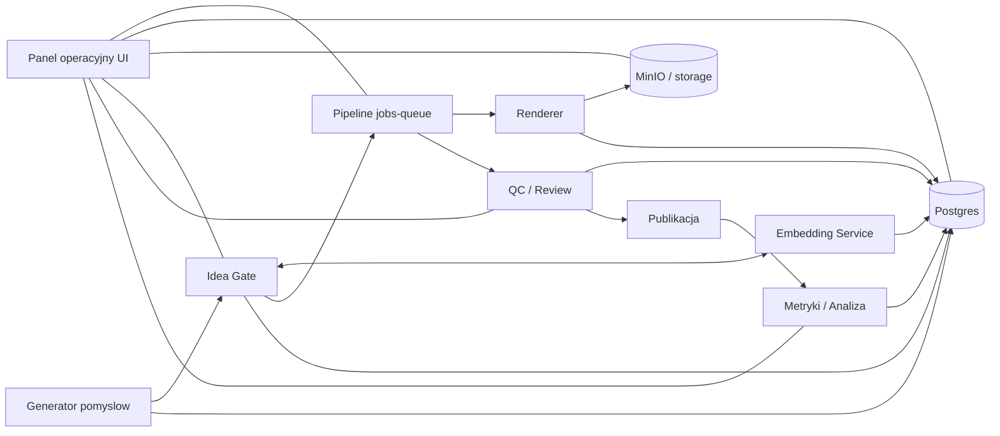

# Mapa zaleznosci modulow

## Uwagi
- Idea Gate jest opcjonalny w pipeline (tryb auto lub wybor operatora).
- Embedding Service jest zaleznoscia Idea Gate i Generatora (deduplikacja, podobienstwo).
- UI to modul przekrojowy: podglad statusow, metadanych i artefaktow z DB/MinIO.
